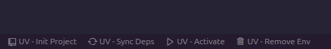

# UV Wingman

This is the README for the extension [UV Wingman](https://marketplace.visualstudio.com/items?itemName=DJSaunders1997.uv-wingman).

This extension aims to help VSCode users manage and interact with UV environments.
UV Wingman aims to add QoL improvements that help programmers use environments without having to memorize all of the UV commands.

## Features

UV Wingman dynamically adds status bar items for quick UV command access when a `requirements.txt` file is open, simplifying UV environment management directly within VSCode.

These can also be accessed from the VSCode command palette:

The supported commands are:

### Creating Environments 
- **Command:** Create a UV environment from the open requirements file by running: `uv env create -f YOUR-REQUIREMENTS.TXT`

- **VS Code Command Palette:** `>UV Wingman: Build UV Environment from requirements.txt file`

### Activating Environments
- **Command:** Activate a UV environment using: `source .venv/bin/activate`

- **VS Code Command Palette:** `>UV Wingman: Activate UV Environment`

### Installing Packages
- **Command:** Install packages from a `requirements.txt` file using: `uv pip install -r YOUR-REQUIREMENTS.TXT`

- **VS Code Command Palette:** `>UV Wingman: Install Packages from requirements.txt file`

### Writing Requirements Files
- **Command:** Export the active UV environment to a requirements file with: `uv pip freeze > YOUR_REQUIREMENTS_FILE`

- **VS Code Command Palette:** `>UV Wingman: Write a requirements.txt file from the active UV Environment`

### Deleting Environments
- **Command:** Remove an existing UV environment by first deactivating, then removing it with: `deactivate` then `rm -rf .venv`
- **VS Code Command Palette:** `>UV Wingman: Delete UV Environment`

## Release Notes

See [CHANGELOG](CHANGELOG.md) for more information.

## Contributing

All contributions are welcome! 
Please feel free to fork the repository and create a pull request.

## License

Distributed under the MIT License. See [LICENSE](LICENSE) for more information.

## Author

David Saunders - 2024