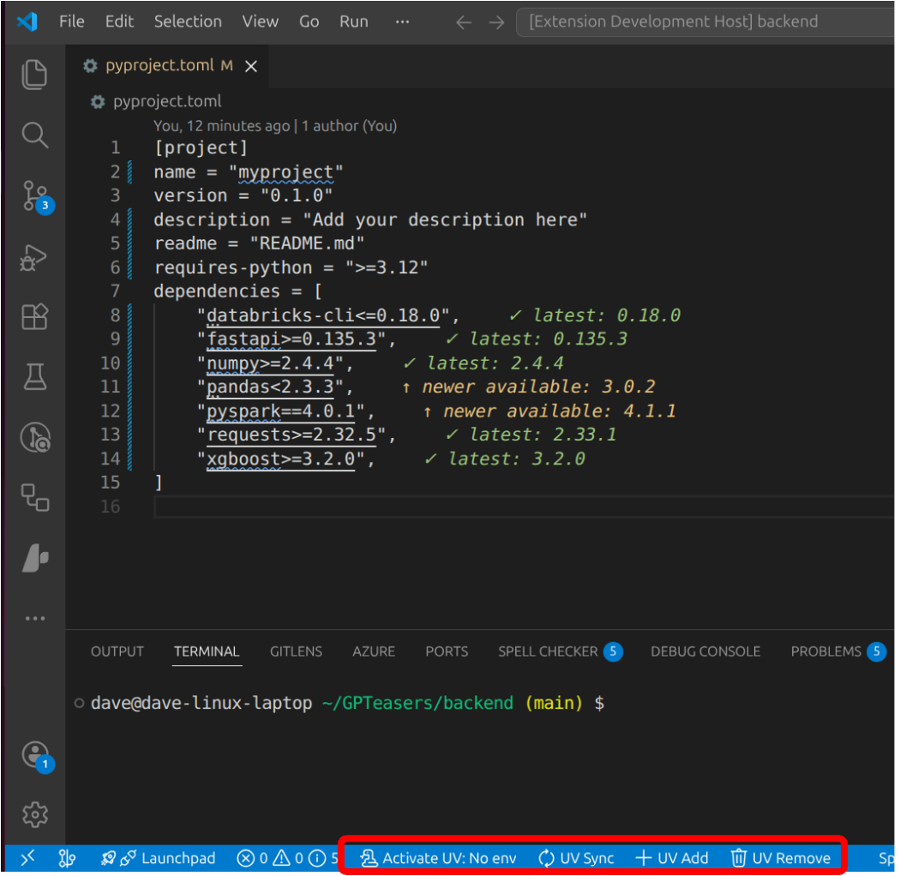
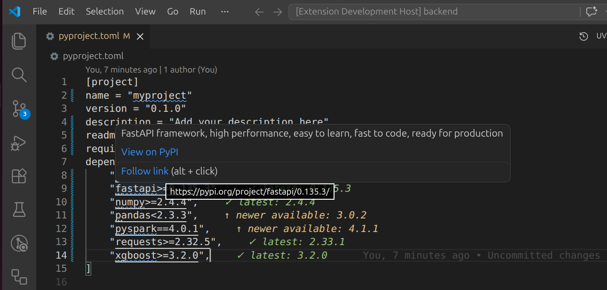
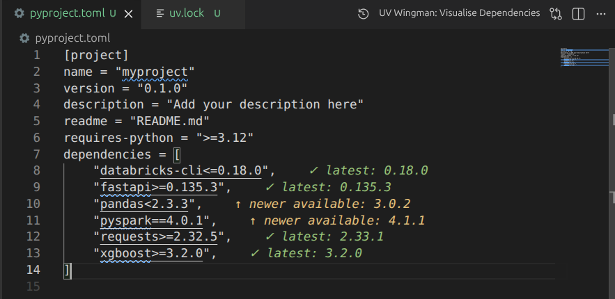
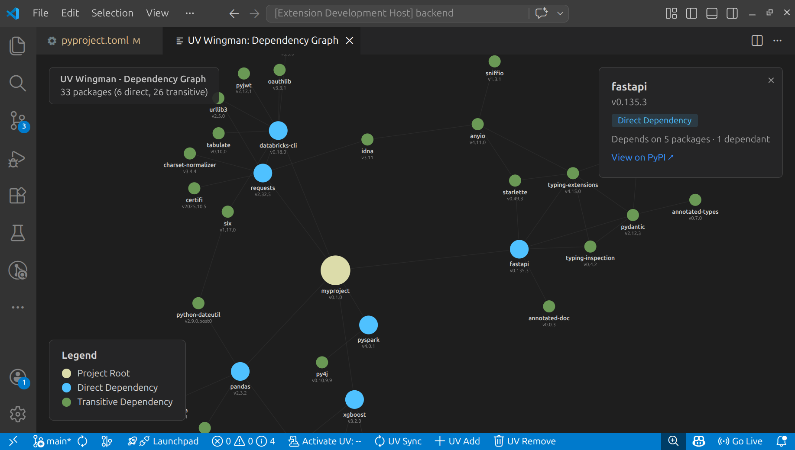

# UV Wingman

**UV Wingman** brings [uv](https://docs.astral.sh/uv/) package management into VS Code so you can manage Python environments without leaving your editor.

## Overview

## Features

Activates automatically when `pyproject.toml` is detected in your workspace root.

### Status Bar

Quick-access buttons for common workflows -- no need to open the Command Palette or terminal.

- **Python version** (click to activate environment) -- shows "No env" when missing
- Sync, Add Package, Delete Environment
- **Init** button appears only when no `pyproject.toml` exists yet

### Commands

All commands are available via the Command Palette (`Ctrl+Shift+P`).

| Palette Title | Description |
|--------------|-------------|
| **Initialize UV Project** | Scaffold a new UV project (`uv init`) |
| **Create Environment from pyproject.toml** | Create and activate a virtual environment |
| **Activate UV Environment** | Activate the environment (shell-aware) |
| **Sync Dependencies with pyproject.toml** | Sync with optional dry-run preview |
| **Lock Dependencies** | Update the lock file |
| **Delete Environment** | Remove the virtual environment (with confirmation) |
| **Add Package** | Add a package via input box |
| **Remove Package** | Remove a package via quick-pick list |
| **Run Script** | Pick and run a script from `[project.scripts]` |
| **Visualise Dependencies** | Open interactive dependency graph |

### Inline PyPI Links

Package names in `pyproject.toml` and `uv.lock` are **clickable hyperlinks** to PyPI. Just Ctrl/Cmd+click any dependency name.

### Inline Version Hints

Dependencies in `pyproject.toml` show the **latest PyPI version** as greyed-out text at the end of each line. Hover for a description and PyPI link.

- Green "latest: X.Y.Z" -- your specifier allows the latest version
- Yellow "newer available: X.Y.Z" -- a newer version exists that your specifier blocks

### Dependency Graph

Open `uv.lock` or `pyproject.toml` and click **UV Wingman: Visualise Dependencies** in the editor title menu to see an interactive dependency graph.

- **Colour-coded nodes**: root (yellow), direct (blue), transitive (green)
- **Interactivity**: zoom, pan, drag, hover to highlight, click for details and PyPI links

### Smart Defaults

- **Auto interpreter**: Sets the VS Code Python interpreter after create/activate/sync
- **Shell detection**: Correct commands for PowerShell, cmd, Git Bash, WSL, Bash, Zsh, and Fish
- **uv availability check**: Warns if `uv` is not installed, with a link to install it

## Settings

| Setting | Default | Description |
|---------|---------|-------------|
| `uvWingman.envName` | `.venv` | Virtual environment directory name |
| `uvWingman.showStatusBarItems` | `true` | Show/hide status bar buttons |
| `uvWingman.autoSetInterpreter` | `true` | Auto-set Python interpreter on env create/activate |

## Troubleshooting

- **Extension not activating?** Requires `pyproject.toml` in the workspace root. Open the project directory directly in VS Code.
- **`uv` not found?** Install via the [official guide](https://docs.astral.sh/uv/getting-started/installation/) and restart VS Code.
- **Custom env name?** Set `uvWingman.envName` to `venv` or `env` in your workspace settings.

## Future Ideas

- **Monorepo / subdirectory support**: Currently expects `pyproject.toml` in the workspace root.
- **Inline version hints in uv.lock**: Freshness indicators for locked versions, not just hover tooltips.
- **Custom PyPI index support**: Private package index for version lookups.

## Contributing

All contributions are welcome! Please feel free to fork the repository and create a pull request.

## Release Notes

See [CHANGELOG](CHANGELOG.md) for full version history.

## License

Distributed under the MIT License. See [LICENSE](LICENSE) for more information.

## Author

David Saunders - 2024-2026
